# Laporan Praktikum

|       | Pemrograman Berbasis Framework 2025 |
| ----- | ----------------------------------- |
| NIM   | 244107027010                        |
| Nama  | Bimo Cahyo Kusumo                   |
| Kelas | TI - 4K                             |

## Langkah Praktikum

### A. Setup Environment NextJS

1. Inisialisasi project NextJS dengan konfigurasi seperti berikut ini. Opsi untuk **App Router** tidak digunakan

   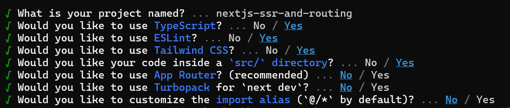

### B. Membuat Halaman dengan Server-Side Rendering (SSR)

1. Buka file `pages/index.tsx` dan ganti kodenya menjadi seperti berikut ini.

   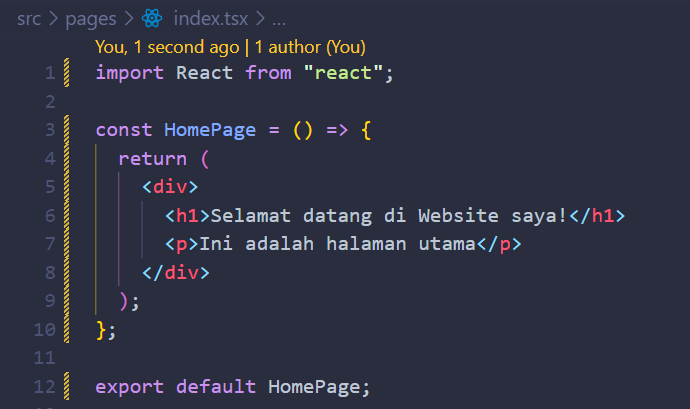

2. Jalankan projectnya dengan perintah `npm run dev` pada terminal Text Editor dan lihat tampilan website pada browser.

   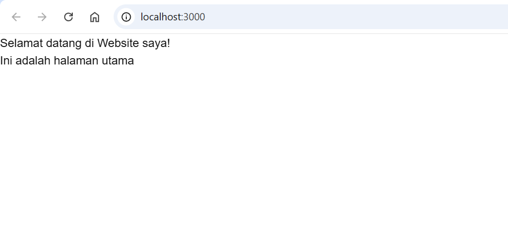

### C. Menggunakan Static Site Generation (SSG)

1. Buat file baru di direktori `pages` dengan nama `blog.js`

2. Tambahkan kode untuk membuat halaman blog berikut.

   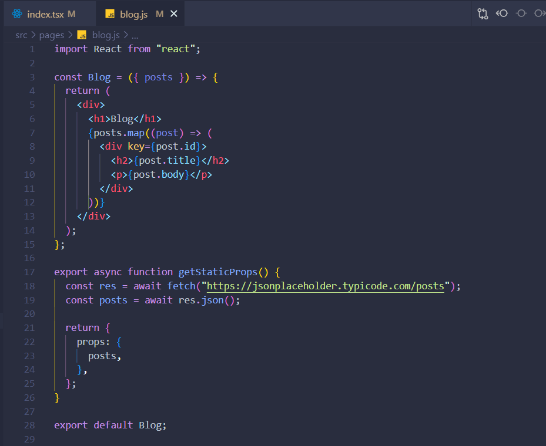

3. Tampilan halaman **blog** pada browser

   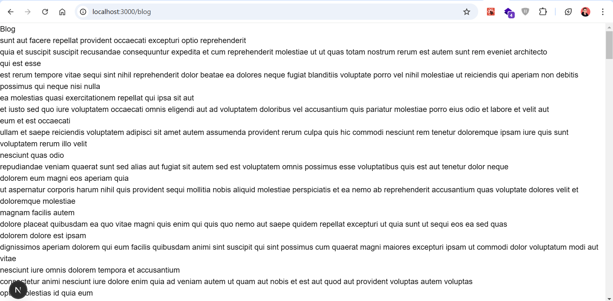

### D. Menggunakan Dynamic Routes

1. Buat direktori baru di `pages` dengan nama `blog`

2. Selanjutnya, buat file dengan nama `[slug].js` pada folder blog tadi dan tambahkan dengan kode berikut.

   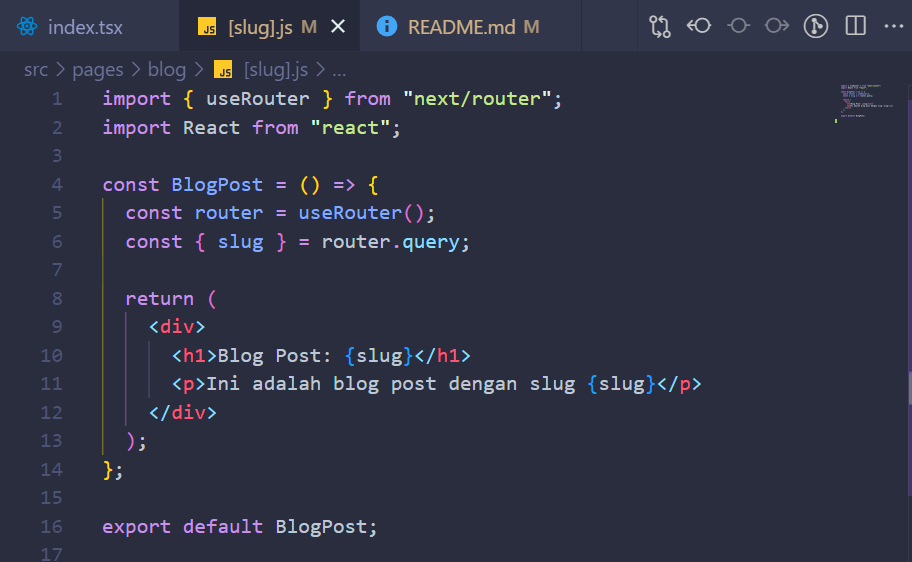

3. Tampilan halaman **slug** pada browser

   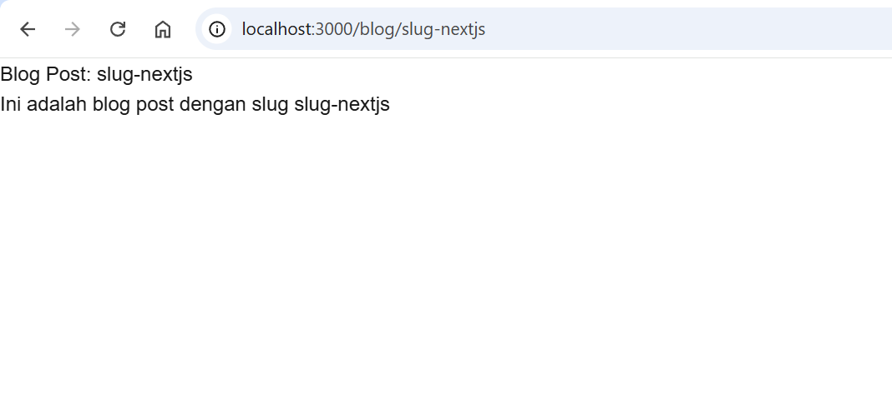

### E. Menggunakan API Routes

1. Buat file di dalam direktori `pages/api` dengan nama `products.js`

2. Tambahkan kode berikut untuk membuat API route yang mengembalikan daftar produk.

   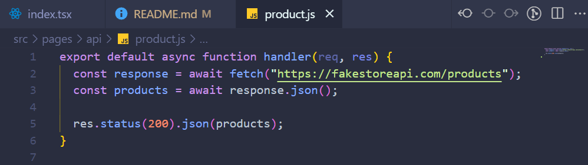

3. Lalu, buat file baru di folder `pages` dengan nama `products.js` untuk menampilkan daftar produk dari API sebelumnya dibuat.

   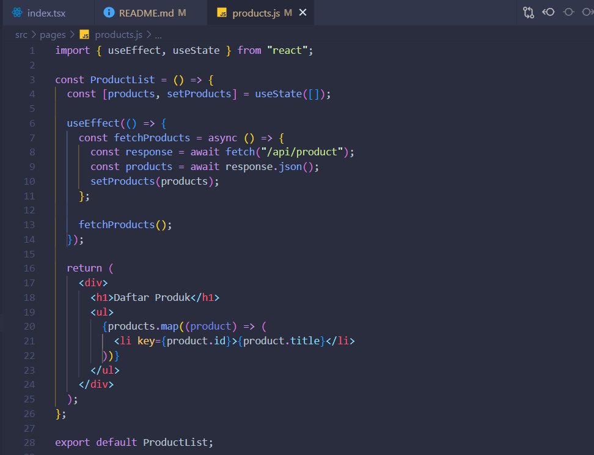

4. Tampilan halaman **products** pada browser

   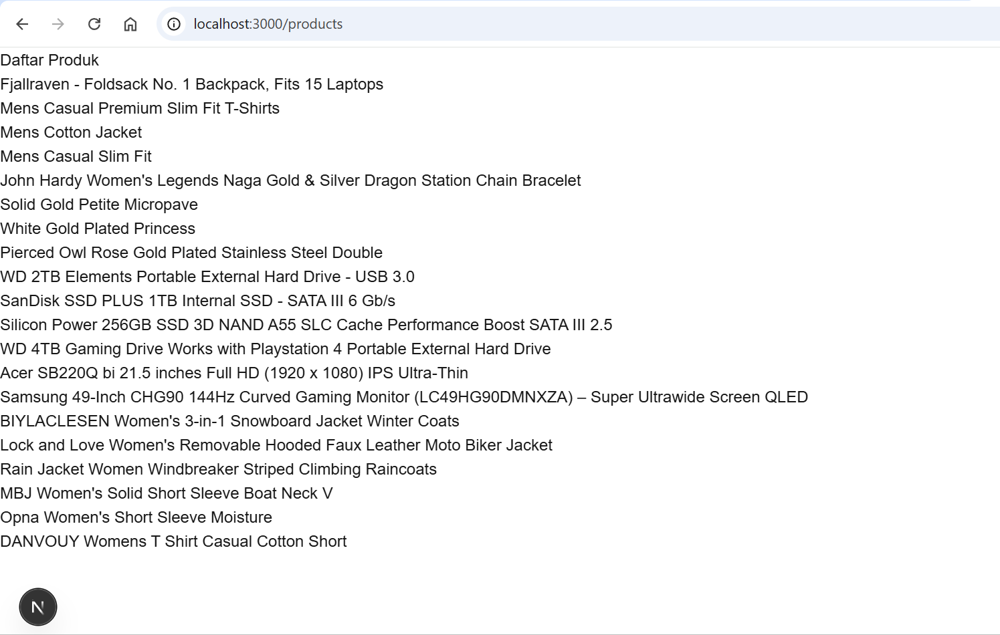

### F. Menggunakan Link Component

1. Buka file `pages/index.tsx` dan tambahkan modif dengan kode berikut untuk membuat link ke
halaman lain.

   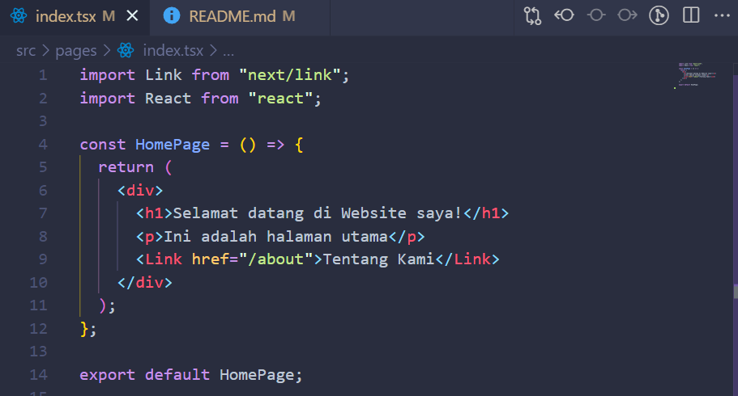

2. Buat file baru pada direktori `pages` dengan nama `about.js` dan tambahkan kode berikut ini.

   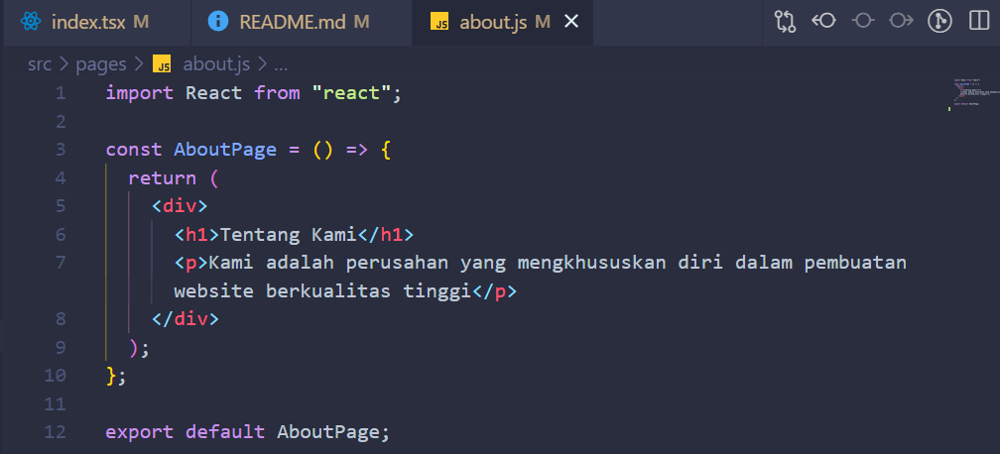

3. Buka url http://localhost:3000 di browser. Klik link "Tentang Kami" untuk navigasi ke
halaman about.

   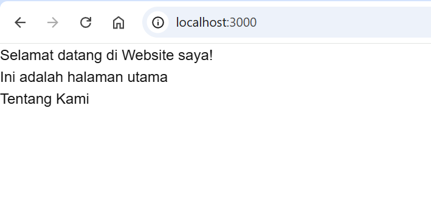

   Setelah diklik, maka mengarahkan ke url http://localhost:3000/about dengan tampilan seperti berikut.

   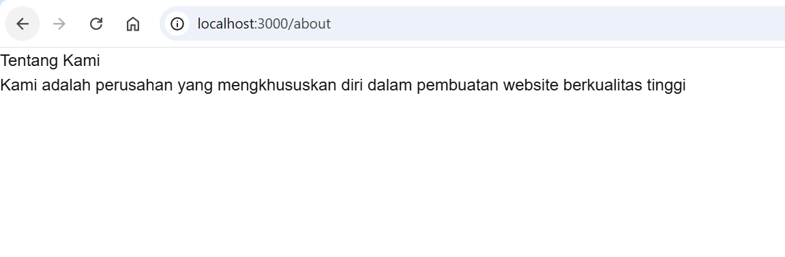

## Tugas

1. Buat halaman baru dengan menggunakan Static Site Generation (SSG) yang menampilkan daftar pengguna dari API https://jsonplaceholder.typicode.com/users.

   **Screenshot:**
   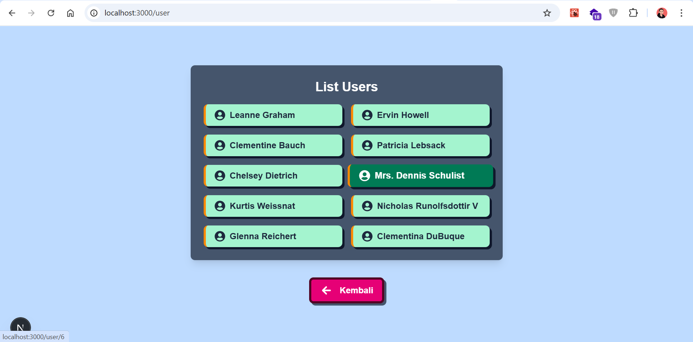

2. Implementasikan Dynamic Routes untuk menampilkan detail pengguna berdasarkan ID

   **Screenshot:**
   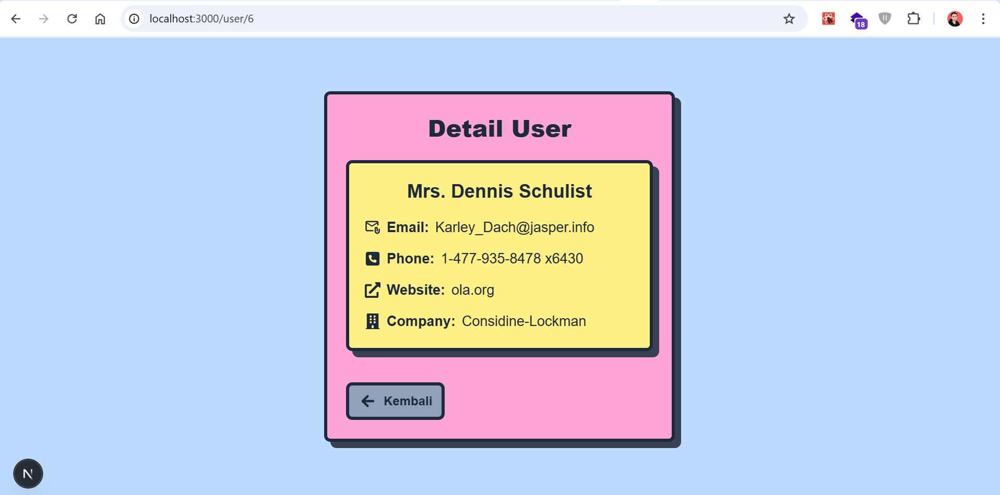 

3. Buat API route yang mengembalikan data cuaca dari API eksternal (misalnya, OpenWeatherMap)
dan tampilkan data tersebut di halaman front-end

   **Screenshoot:**
   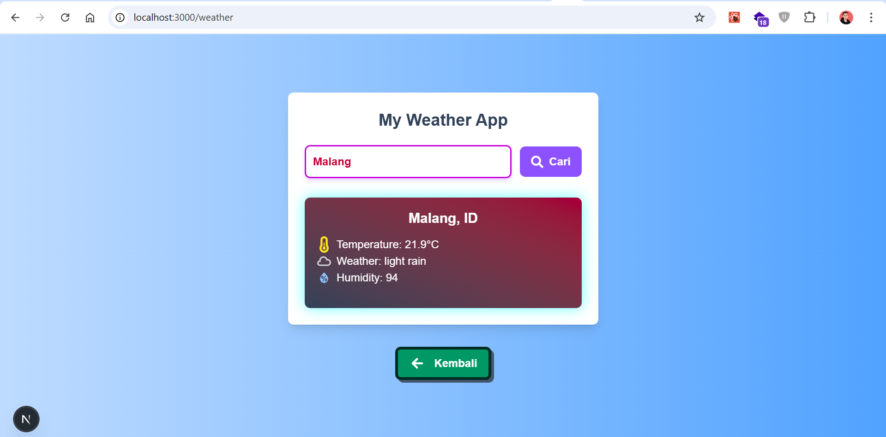